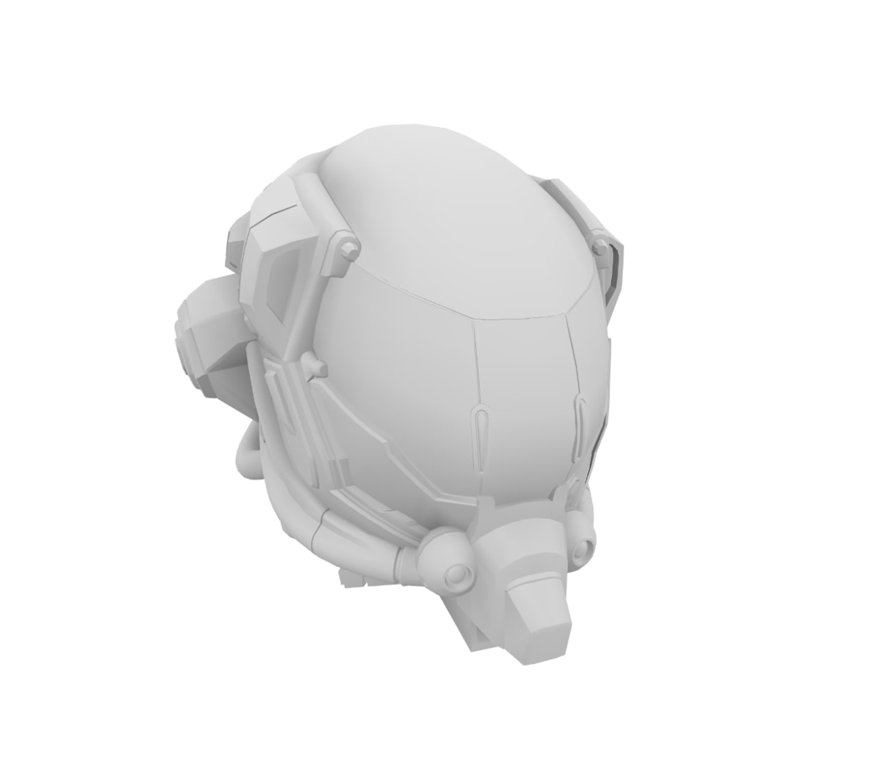
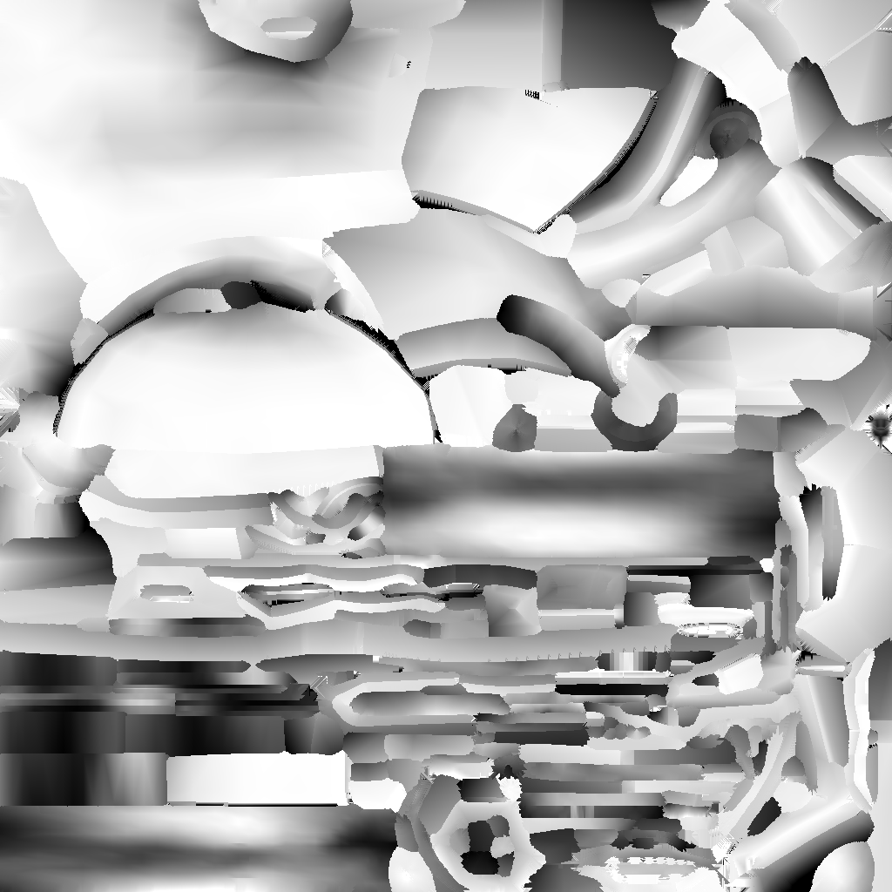

# geo-ambient-occlusion-three

A Three.js wrapper for [geo-ambient-occlusion](https://github.com/wwwtyro/geo-ambient-occlusion) that allows you to bake ambient occlusion into **vertex colors** or **textures** for arbitrary meshes.

<p align="center">
  
</p>

---

## Features

- Compute **per-vertex ambient occlusion** for Three.js meshes.
- Optionally bake AO into a **texture**.
- Baked texture have Dilation
<p align="center">
  
</p>

---

## Installation

```bash
npm install geo-ambient-occlusion-three
```

---

## Usage Example

```ts
import * as THREE from "three";
import { vertexBake, textureBake } from "geo-ambient-occlusion-three";
import { GLTFLoader } from "three/examples/jsm/loaders/GLTFLoader.js";

const scene = new THREE.Scene();
const loader = new GLTFLoader();
loader.load(
  "./scene.glb",
  (gltf) => {
    scene.add(gltf.scene);
    vertexBake(scene, { resolution: 1024, bakeTexture: true });
    scene.traverse((obj) => {
      if ((obj as THREE.Mesh).isMesh) {
        const material = (obj as THREE.Mesh).material;
        if (!Array.isArray(material)) material.vertexColors = true;
      }
    });
  },
  undefined,
  (err) => {
    console.error("Error loading GLTF", err);
  }
);
```

---

## Notes

- Requires WebGL support for `OES_texture_float`.
- Safari support is currently limited.
- Designed to work efficiently with Three.js `BufferGeometry`.
